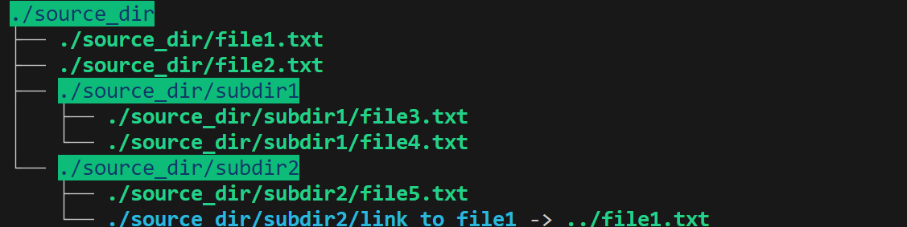
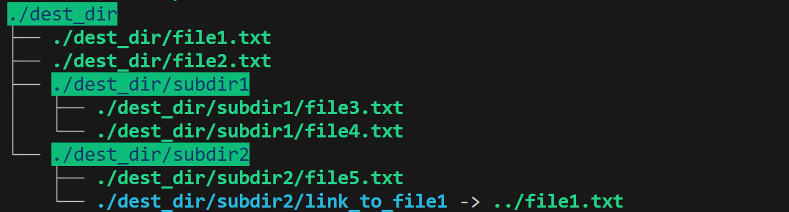

# Backup Tool 📂  

🔗 C program that creates lightweight backups preserving hard links and symlinks

## Table of Contents  

1. [About](#about)  
2. [Features](#features)  
3. [Requirements](#requirements)  
4. [Installation](#installation)  
5. [Usage](#usage)  

---

## About  

The **Backup Tool** is a C program that efficiently creates a full backup of a given directory while preserving its structure, symbolic links, and file permissions.  
Instead of copying the actual file data, the program uses **hard links** to save disk space and ensure that changes in the source are immediately reflected in the backup.  

This project demonstrates system-level file operations such as `link`, `symlink`, `lstat`, and recursive directory traversal — providing a practical implementation of Linux file system concepts like **inodes**, **permissions**, and **symbolic references**.

---

## Features  

- Recursive backup of entire directory trees, including all nested subdirectories.  
- Creates hard links for regular files instead of duplicating file content, saving disk space and time.  
- Recreates symbolic links without following them, preserving original link targets.  
- Retains original file and directory permissions during the backup process.  
- Uses efficient low-level system calls for fast execution.  
- Ensures the destination folder perfectly mirrors the source structure.

---

## Requirements  

- Linux or macOS environment (or Windows with WSL)  
- GCC (GNU Compiler Collection) or another C compiler  
- Make utility for building the project  
- Git for cloning the repository

---

## Installation

Follow these steps to set up the project locally:

---

### 1. Clone the repository
```bash
git clone https://github.com/Amit-Bruhim/Backup-Tool.git
```
### 2. Navigate into the project folder
```bash
cd Backup-Tool
```

### 3. Compile and Run the program using Make
```bash
make run
```

---

## Usage  

When running the program, a full backup of the source directory is created at the specified destination path.  
The resulting backup directory replicates the entire structure, including files, subdirectories, and symbolic links.

### Example  

Below is an example of the source directory and the generated backup directory after running the program:

**Source Directory**



**Backup Directory**



> **Note:**  
> For convenience, the repository already includes a sample source directory (`source_dir`) and a predefined destination path (`dest_dir`).  
> You can easily modify these paths in the `Makefile` to use your own directories.

